# IAM Access Analyzer Workshop - Complete Use Cases Guide

## Overview

AWS IAM Access Analyzer helps you identify resources in your organization and accounts that are shared with external entities. This workshop provides comprehensive use cases and examples to test different scenarios and understand how Access Analyzer works in practice.

## What is IAM Access Analyzer?

IAM Access Analyzer uses provable security (mathematical logic) to analyze resource policies and identify resources that can be accessed from outside your zone of trust. It generates findings for resources that allow access to external principals.

### Key Features:
- **External Access Detection** - Identifies resources accessible outside your zone of trust
- **Policy Validation** - Validates IAM policies against AWS best practices
- **Archive Rules** - Reduces noise by archiving expected findings
- **Continuous Monitoring** - Monitors for new external access grants
- **Integration** - Works with EventBridge, CloudTrail, and other AWS services

## Zone of Trust

- **Account Zone** - Your AWS account is the zone of trust
- **Organization Zone** - Your AWS Organization is the zone of trust

## IAM Access Analyzer Use Cases

### 1. IAM Access Analyzer Features Distribution (Pie Chart)


### 2. Comprehensive Use Cases Diagram - Part 1 (Core Security)


### 3. Comprehensive Use Cases Diagram - Part 2 (Policy & Monitoring)


### 4. Comprehensive Use Cases Diagram - Part 3 (Governance & Integration)


## AWS re:Inforce 2025: announcement
https://aws.amazon.com/blogs/aws/verify-internal-access-to-critical-aws-resources-with-new-iam-access-analyzer-capabilities/

## IAM Access Analyzer Analysis Overview

### Type of Analyzers


### External Access


### Supported Resources - external access


### Internal Access (AWS re:Inforce 2025: announcement)


### Internal Access (AWS re:Inforce 2025: announcement)

``` text
It uses automated reasoning to collectively evaluate multiple policies, including service control policies (SCPs), resource control policies (RCPs),
and identity-based policies, and generates findings when a user or role has access to your S3 buckets,
Amazon DynamoDB tables, or Amazon Relational Database Service (Amazon RDS) snapshots.

Internal Access findings are INFORMATIONAL, not necessarily PROBLEMATIC. They help you:

1. Understand your access landscape - Purpose: Shows WHO has access to WHAT resources within your organization
2. Validate least privilege implementation - Purpose: Identifies potentially excessive internal permissions
3. Meet compliance requirements - Purpose: Documents all access paths for audit requirements
4. Detect unauthorized access changes - Purpose: Highlights high-value resources with internal access, Establishes baseline for future access changes (change detection)

```

### Unused Access 


## Use Cases and Examples

### 1. S3 Bucket External Access

#### Use Case: Public S3 Bucket Detection
**Scenario**: Detect S3 buckets that allow public read access

**Example Policy** (Bucket Policy):
```json
{
  "Version": "2012-10-17",
  "Statement": [
    {
      "Effect": "Allow",
      "Principal": "*",
      "Action": "s3:GetObject",
      "Resource": "arn:aws:s3:::my-public-bucket/*"
    }
  ]
}
```

**Expected Finding**: Public access to S3 bucket

**🔍 Engineer Notes:**
- **Why Monitor**: Public S3 buckets can expose sensitive data to the internet, leading to data breaches
- **Security Risk**: HIGH - Anyone can access bucket contents without authentication
- **Common Causes**: Misconfigured bucket policies, disabled Block Public Access settings
- **Business Impact**: Data exposure, compliance violations, potential fines

**📋 Archive Criteria:**
- **Safe to Archive**: Static website hosting buckets, public documentation, marketing assets
- **Archive Conditions**: Bucket name contains 'website-', 'public-', 'static-', or 'cdn-'
- **Security Validation**: Verify bucket contains only non-sensitive public content
- **Documentation Required**: Business justification for public access documented

**Archive Rule**: Archive if this is an intentional public website bucket

#### Use Case: Cross-Account S3 Access
**Scenario**: S3 bucket shared with specific external AWS account

**Example Policy**:
```json
{
  "Version": "2012-10-17",
  "Statement": [
    {
      "Effect": "Allow",
      "Principal": {
        "AWS": "arn:aws:iam::123456789012:root"
      },
      "Action": "s3:GetObject",
      "Resource": "arn:aws:s3:::shared-bucket/*"
    }
  ]
}
```

**Expected Finding**: External account access

**🔍 Engineer Notes:**
- **Why Monitor**: Cross-account access can lead to unauthorized data access if external account is compromised
- **Security Risk**: MEDIUM-HIGH - External account has broad access to bucket contents
- **Common Causes**: Business partnerships, data sharing agreements, third-party integrations
- **Business Impact**: Data exposure to external entities, potential compliance issues

**📋 Archive Criteria:**
- **Safe to Archive**: Verified trusted partner accounts, documented business relationships
- **Archive Conditions**: Account ID in approved partner list, signed data sharing agreement exists
- **Security Validation**: External account has legitimate business need, regular access reviews conducted
- **Documentation Required**: Partnership agreement, data classification, access justification

**Archive Rule**: Archive if 123456789012 is a trusted partner account

### 2. IAM Role External Access

#### Use Case: Cross-Account Role Assumption
**Scenario**: IAM role that can be assumed by external account

**Example Trust Policy**:
```json
{
  "Version": "2012-10-17",
  "Statement": [
    {
      "Effect": "Allow",
      "Principal": {
        "AWS": "arn:aws:iam::987654321098:root"
      },
      "Action": "sts:AssumeRole",
      "Condition": {
        "StringEquals": {
          "sts:ExternalId": "unique-external-id"
        }
      }
    }
  ]
}
```

**Expected Finding**: External account can assume role

**🔍 Engineer Notes:**
- **Why Monitor**: Cross-account role assumption grants external entities access to your AWS resources
- **Security Risk**: HIGH - External account can perform actions based on role permissions
- **Common Causes**: Third-party service integrations, partner access, vendor relationships
- **Business Impact**: Potential privilege escalation, unauthorized resource access, compliance violations

**📋 Archive Criteria:**
- **Safe to Archive**: Established vendor relationships, documented service integrations
- **Archive Conditions**: External ID present, trusted vendor account, limited role permissions
- **Security Validation**: Role follows least privilege, conditions restrict access, regular audits performed
- **Documentation Required**: Vendor agreement, security assessment, access review schedule

**Archive Rule**: Archive if this is for a trusted third-party service

#### Use Case: SAML Federation Access
**Scenario**: Role accessible via SAML identity provider

**Example Trust Policy**:
```json
{
  "Version": "2012-10-17",
  "Statement": [
    {
      "Effect": "Allow",
      "Principal": {
        "Federated": "arn:aws:iam::123456789012:saml-provider/CompanySAML"
      },
      "Action": "sts:AssumeRoleWithSAML",
      "Condition": {
        "StringEquals": {
          "SAML:aud": "https://signin.aws.amazon.com/saml"
        }
      }
    }
  ]
}
```

**Expected Finding**: Federated access via SAML

**🔍 Engineer Notes:**
- **Why Monitor**: SAML federation allows external identity providers to access AWS resources
- **Security Risk**: MEDIUM - Depends on external IdP security and SAML assertion validation
- **Common Causes**: Corporate SSO integration, partner federation, identity provider setup
- **Business Impact**: Potential unauthorized access if IdP is compromised, identity spoofing risks

**📋 Archive Criteria:**
- **Safe to Archive**: Corporate identity providers, established SSO solutions
- **Archive Conditions**: Known corporate SAML provider, proper conditions in trust policy
- **Security Validation**: IdP security validated, SAML assertions properly configured, MFA enforced
- **Documentation Required**: IdP security assessment, federation agreement, user access controls

**Archive Rule**: Archive for known corporate SAML providers

### 3. Lambda Function External Access

#### Use Case: Lambda Function with Resource Policy
**Scenario**: Lambda function invokable by external service

**Example Resource Policy**:
```json
{
  "Version": "2012-10-17",
  "Statement": [
    {
      "Effect": "Allow",
      "Principal": {
        "Service": "s3.amazonaws.com"
      },
      "Action": "lambda:InvokeFunction",
      "Resource": "arn:aws:lambda:us-east-1:123456789012:function:MyFunction",
      "SourceArn": "arn:aws:s3:::my-bucket"
    }
  ]
}
```

**Expected Finding**: External service access (if S3 bucket is external)

**🔍 Engineer Notes:**
- **Why Monitor**: Lambda functions with external access can be invoked by unauthorized sources
- **Security Risk**: LOW-MEDIUM - AWS service principals are generally safe, but source validation is critical
- **Common Causes**: Event-driven architectures, S3 triggers, API Gateway integrations
- **Business Impact**: Potential function abuse, unexpected costs, resource exhaustion

**📋 Archive Criteria:**
- **Safe to Archive**: AWS service principals with proper source ARN restrictions
- **Archive Conditions**: Principal is AWS service, SourceArn condition present and specific
- **Security Validation**: Source ARN points to trusted resource, function has minimal permissions
- **Documentation Required**: Architecture documentation, event source validation, cost monitoring

**Archive Rule**: Archive for AWS service principals

### 4. KMS Key External Access

#### Use Case: KMS Key Shared Externally
**Scenario**: KMS key accessible by external account

**Example Key Policy**:
```json
{
  "Version": "2012-10-17",
  "Statement": [
    {
      "Effect": "Allow",
      "Principal": {
        "AWS": "arn:aws:iam::111122223333:root"
      },
      "Action": [
        "kms:Decrypt",
        "kms:GenerateDataKey"
      ],
      "Resource": "*"
    }
  ]
}
```

**Expected Finding**: External account KMS access

**🔍 Engineer Notes:**
- **Why Monitor**: KMS key sharing allows external accounts to decrypt sensitive data
- **Security Risk**: HIGH - External access to encryption keys can compromise data confidentiality
- **Common Causes**: Cross-account data sharing, backup encryption, partner data exchange
- **Business Impact**: Data exposure, encryption key compromise, compliance violations

**📋 Archive Criteria:**
- **Safe to Archive**: Verified trusted partners with legitimate encryption needs
- **Archive Conditions**: Partner in approved list, limited key actions, data sharing agreement
- **Security Validation**: Partner security assessment completed, key usage monitored, regular access review
- **Documentation Required**: Data sharing agreement, encryption requirements, partner security validation

**Archive Rule**: Archive for trusted encryption partners

### 5. SQS Queue External Access

#### Use Case: SQS Queue Cross-Account Access
**Scenario**: SQS queue accessible by external account

**Example Queue Policy**:
```json
{
  "Version": "2012-10-17",
  "Statement": [
    {
      "Effect": "Allow",
      "Principal": {
        "AWS": "arn:aws:iam::444455556666:root"
      },
      "Action": "sqs:SendMessage",
      "Resource": "arn:aws:sqs:us-east-1:123456789012:MyQueue"
    }
  ]
}
```

**Expected Finding**: External account SQS access

**🔍 Engineer Notes:**
- **Why Monitor**: SQS queue access allows external accounts to send/receive messages
- **Security Risk**: MEDIUM - External accounts can inject malicious messages or consume sensitive data
- **Common Causes**: Microservices integration, partner API communication, event-driven architectures
- **Business Impact**: Message tampering, data leakage, service disruption, unexpected costs

**📋 Archive Criteria:**
- **Safe to Archive**: Established integration partners, documented message flows
- **Archive Conditions**: Partner in approved list, limited queue actions, message validation in place
- **Security Validation**: Message encryption enabled, dead letter queues configured, access patterns monitored
- **Documentation Required**: Integration documentation, message schema validation, partner agreement

**Archive Rule**: Archive for integration partner accounts

### 6. Secrets Manager External Access

#### Use Case: Secret Shared with External Account
**Scenario**: Secrets Manager secret accessible externally

**Example Resource Policy**:
```json
{
  "Version": "2012-10-17",
  "Statement": [
    {
      "Effect": "Allow",
      "Principal": {
        "AWS": "arn:aws:iam::777788889999:role/ExternalServiceRole"
      },
      "Action": "secretsmanager:GetSecretValue",
      "Resource": "*"
    }
  ]
}
```

**Expected Finding**: External access to secrets

**🔍 Engineer Notes:**
- **Why Monitor**: Secrets Manager contains highly sensitive credentials and API keys
- **Security Risk**: CRITICAL - External access to secrets can compromise entire infrastructure
- **Common Causes**: Service integrations, partner API access, shared credentials for integrations
- **Business Impact**: Complete system compromise, credential theft, unauthorized system access

**📋 Archive Criteria:**
- **Safe to Archive**: RARELY - Only for highly trusted, security-validated partners
- **Archive Conditions**: Specific role (not root), limited secret access, strong justification
- **Security Validation**: Partner security audit passed, secret rotation enabled, access logging active
- **Documentation Required**: Security assessment, incident response plan, regular access review

**Archive Rule**: Archive for trusted service integrationse Rule**: Archive for trusted service integrations

## Archive Rules Examples

### 1. Archive Public Website Buckets
```yaml
- RuleName: 'public-website-buckets'
  Filter:
    - Property: 'resource'
      Contains:
        - 'arn:aws:s3:::website-'
        - 'arn:aws:s3:::public-'
    - Property: 'isPublic'
      Eq:
        - 'true'
```

### 2. Archive Trusted Partner Accounts
```yaml
- RuleName: 'trusted-partners'
  Filter:
    - Property: 'principal.AWS'
      Eq:
        - 'arn:aws:iam::123456789012:root'
        - 'arn:aws:iam::987654321098:root'
    - Property: 'isPublic'
      Eq:
        - 'false'
```

### 3. Archive AWS Service Access
```yaml
- RuleName: 'aws-services'
  Filter:
    - Property: 'principal.Service'
      Contains:
        - 'lambda.amazonaws.com'
        - 's3.amazonaws.com'
        - 'events.amazonaws.com'
```

### 4. Archive SAML Federation
```yaml
- RuleName: 'corporate-saml'
  Filter:
    - Property: 'principal.Federated'
      Contains:
        - ':saml-provider/CompanySAML'
        - ':saml-provider/OktaSAML'
```

## Other Scenarios

### Scenario 1: AI/ML Workload Security
**Setup**: Deploy AI agent with S3 data bucket, Lambda functions, and cross-account model access
**Test**: Verify external access detection for model sharing
**Expected**: Findings for external model account access
**Archive**: Rules for trusted AI service accounts

### Scenario 2: Multi-Account Organization
**Setup**: Organization with dev/staging/prod accounts
**Test**: Cross-account resource sharing
**Expected**: Findings for cross-account access outside organization
**Archive**: Rules for internal organization accounts

### Scenario 3: Third-Party Integration
**Setup**: SQS queues and Lambda functions for external API integration
**Test**: External service access permissions
**Expected**: Findings for third-party service access
**Archive**: Rules for known integration partners

### Scenario 4: Data Analytics Pipeline
**Setup**: S3 buckets shared with analytics account, KMS keys for encryption
**Test**: Cross-account data access patterns
**Expected**: Findings for analytics account access
**Archive**: Rules for trusted analytics partners


# Workshop Labs 

### Lab 1: Basic Setup - Step by Step Console Instructions

#### Step 1: Create Access Analyzer with Account Zone of Trust

1. **Navigate to IAM Access Analyzer**
   - Open AWS Console
   - Go to **IAM** service
   - In left navigation, click **Access analyzer**
   - Click **Create analyzer**

2. **Configure Analyzer Settings**
   - **Analyzer name**: Enter `workshop-analyzer`
   - **Zone of trust**: Select **Current account**
   - **Region**: Ensure you're in your preferred region (e.g., us-east-1)
   - Click **Create analyzer**

3. **Verify Creation**
   - Wait for analyzer status to show **Active**
   - Note the analyzer ARN for reference

#### Step 2: Deploy Sample S3 Bucket with Public Access

1. **Create S3 Bucket**
   - Navigate to **S3** service
   - Click **Create bucket**
   - **Bucket name**: `workshop-public-bucket-[your-account-id]` (must be globally unique)
   - **Region**: Same as your Access Analyzer
   - **Block Public Access settings**: Uncheck **Block all public access**
   - Check the acknowledgment box
   - Click **Create bucket**

2. **Add Public Bucket Policy**
   - Click on your newly created bucket
   - Go to **Permissions** tab
   - Scroll to **Bucket policy** section
   - Click **Edit**
   - Paste the following policy (replace `YOUR-BUCKET-NAME`):
   ```json
   {
     "Version": "2012-10-17",
     "Statement": [
       {
         "Effect": "Allow",
         "Principal": "*",
         "Action": "s3:GetObject",
         "Resource": "arn:aws:s3:::YOUR-BUCKET-NAME/*"
       }
     ]
   }
   ```
   - Click **Save changes**

3. **Upload Test File**
   - Go to **Objects** tab
   - Click **Upload**
   - Add a test file (e.g., `test.txt`)
   - Click **Upload**

#### Step 3: Review Generated Findings

1. **Wait for Analysis** (5-10 minutes)
   - Access Analyzer runs continuously but may take time for initial findings

2. **View Findings**
   - Return to **IAM** > **Access analyzer**
   - Click on your `workshop-analyzer`
   - Click **Findings** tab
   - You should see a finding for your S3 bucket

3. **Examine Finding Details**
   - Click on the S3 bucket finding
   - Review the following information:
     - **Resource**: Your bucket ARN
     - **Resource type**: AWS::S3::Bucket
     - **External principal**: * (public access)
     - **Access level**: Read
     - **Condition**: None
     - **Action**: s3:GetObject

4. **Understanding the Finding**
   - **Status**: Active (needs attention)
   - **Public**: Yes (accessible from internet)
   - **Principal**: * (anyone can access)

#### Step 4: Create Archive Rule for Public Buckets

1. **Navigate to Archive Rules**
   - In your Access Analyzer dashboard
   - Click **Archive rules** tab
   - Click **Create archive rule**

2. **Configure Archive Rule**
   - **Rule name**: `public-website-buckets`
   - **Description**: `Archive findings for intentional public website buckets`

3. **Set Filter Criteria**
   - Click **Add filter**
   - **Property**: Select `resource`
   - **Operator**: Select `contains`
   - **Value**: Enter `website-` (this will match buckets with 'website-' in the name)
   
   - Click **Add filter** again
   - **Property**: Select `isPublic`
   - **Operator**: Select `equals`
   - **Value**: Select `true`

4. **Review and Create**
   - Review your filter criteria
   - Click **Create archive rule**

5. **Test Archive Rule**
   - Create another S3 bucket named `website-test-bucket-[account-id]`
   - Apply the same public policy
   - Wait 5-10 minutes
   - Check that this finding is automatically archived

#### Verification Steps

1. **Check Active Findings**
   - Go to **Findings** tab
   - Verify your original bucket finding is still **Active**
   - Verify the website bucket finding is **Archived** (if created)

2. **View Archived Findings**
   - Click **Archived** tab
   - See findings that match your archive rule

#### Expected Results

✅ **Access Analyzer Created**: Status shows Active
✅ **S3 Bucket Finding**: Shows public access to bucket
✅ **Archive Rule Working**: Website buckets automatically archived


#### Cleanup (Optional)

1. **Delete S3 Buckets**
   - Empty bucket contents first
   - Delete the buckets

2. **Keep Access Analyzer**
   - Leave analyzer running for subsequent labs

#### Troubleshooting

- **No findings appear**: Wait 10-15 minutes, Access Analyzer needs time to analyze
- **Archive rule not working**: Check filter syntax and property names
- **Can't create public bucket**: Verify Block Public Access settings are disabled
- **Policy error**: Ensure bucket name in policy matches actual bucket name

### Lab 2: Cross-Account IAM Role - Key Components

#### Overview
This lab creates an IAM role that can be assumed by an external AWS account, which will trigger Access Analyzer findings. We'll create a role with cross-account trust policy and attach permissions that Access Analyzer will flag as external access.

#### Trust Policy JSON
```json
{
  "Version": "2012-10-17",
  "Statement": [
    {
      "Effect": "Allow",
      "Principal": {
        "AWS": "arn:aws:iam::123456789012:root"
      },
      "Action": "sts:AssumeRole",
      "Condition": {
        "StringEquals": {
          "sts:ExternalId": "workshop-external-id"
        }
      }
    }
  ]
}
```

#### Permissions Policy JSON
```json
{
  "Version": "2012-10-17",
  "Statement": [
    {
      "Effect": "Allow",
      "Action": [
        "s3:GetObject",
        "s3:ListBucket"
      ],
      "Resource": [
        "arn:aws:s3:::workshop-*",
        "arn:aws:s3:::workshop-*/*"
      ]
    },
    {
      "Effect": "Allow",
      "Action": [
        "dynamodb:GetItem",
        "dynamodb:Query",
        "dynamodb:Scan"
      ],
      "Resource": "arn:aws:dynamodb:*:*:table/workshop-*"
    },
    {
      "Effect": "Allow",
      "Action": [
        "logs:CreateLogGroup",
        "logs:CreateLogStream",
        "logs:PutLogEvents"
      ],
      "Resource": "arn:aws:logs:*:*:*"
    }
  ]
}
```

#### Step-by-Step Console Instructions

**Step 1: Create IAM Role**
1. Navigate to **IAM** > **Roles** > **Create role**
2. Select **AWS account** > **Another AWS account**
3. Account ID: `123456789012`
4. Check **Require external ID**: `workshop-external-id`
5. Role name: `WorkshopCrossAccountRole`

**Step 2: Attach Permissions**
1. Go to role **Permissions** tab
2. **Add permissions** > **Create inline policy**
3. Use **JSON** tab and paste permissions policy above
4. Policy name: `WorkshopCrossAccountPermissions`

**Step 3: Monitor Access Analyzer**
1. Wait 10-15 minutes for analysis
2. Check **IAM** > **Access analyzer** > **Findings**
3. Look for **AWS::IAM::Role** finding
4. Review external principal: `123456789012`

**Step 4: Create Archive Rule**
1. **Archive rules** tab > **Create archive rule**
2. Rule name: `trusted-partner-accounts`
3. Filter: `principal.AWS` equals `arn:aws:iam::123456789012:root`
4. Filter: `isPublic` equals `false`

#### Expected Access Analyzer Findings

**What Gets Flagged:**
- External AWS account can assume IAM role
- Role has permissions to access S3, DynamoDB, CloudWatch
- Potential unauthorized access to resources
- Cross-account trust relationship detected

**Finding Details:**
- **Resource**: `arn:aws:iam::YOUR-ACCOUNT:role/WorkshopCrossAccountRole`
- **Principal**: `arn:aws:iam::123456789012:root`
- **Action**: `sts:AssumeRole`
- **Access Level**: Various (based on permissions)
- **Condition**: External ID requirement

#### Security Best Practices

**Enhanced Security Measures:**
- ✅ **External ID**: Additional authentication factor
- ✅ **Least Privilege**: Minimal required permissions
- ✅ **Resource Restrictions**: Limit to specific resources
- ✅ **Condition Blocks**: Time-based or IP restrictions
- ✅ **Regular Reviews**: Monitor actual role usage

**Archive Rule Strategy:**
- Archive trusted partner accounts
- Keep unknown external accounts as active findings
- Document business justification for external access
- Regular review of archived vs active findings

#### Troubleshooting

- **No IAM findings**: Wait 15-20 minutes, IAM analysis takes longer
- **Archive rule not working**: Check principal.AWS format matches exactly
- **Can't create role**: Verify you have IAM permissions
- **External ID issues**: Ensure condition syntax is correct in trust policy


### Lab 3: Policy Validation - Step by Step Console Instructions

#### Overview
IAM Access Analyzer Policy Validation helps you validate IAM policies against AWS best practices and security standards before deployment. This lab demonstrates how to create a problematic policy, use policy validation to identify issues, fix them, and retest.

#### What is Policy Validation?

**Policy Validation Features:**
- **Syntax Validation**: Checks for JSON syntax errors
- **Security Warnings**: Identifies overly permissive policies
- **Best Practice Recommendations**: Suggests improvements
- **Resource-Based Policy Analysis**: Validates bucket policies, trust policies, etc.
- **Actionable Suggestions**: Provides specific fixes

**Common Issues Detected:**
- Wildcard permissions (`*`)
- Missing conditions
- Overly broad resource access
- Insecure principal configurations
- Policy size and complexity issues

#### Step 1: Create Problematic IAM Policy

1. **Navigate to IAM Policies**
   - Go to **IAM** > **Policies**
   - Click **Create policy**
   - Click **JSON** tab

2. **Paste Problematic Policy**
   ```json
   {
     "Version": "2012-10-17",
     "Statement": [
       {
         "Effect": "Allow",
         "Action": "*",
         "Resource": "*"
       },
       {
         "Effect": "Allow",
         "Action": [
           "s3:GetObject",
           "s3:PutObject",
           "s3:DeleteObject"
         ],
         "Resource": "arn:aws:s3:::*/*"
       },
       {
         "Effect": "Allow",
         "Action": "iam:*",
         "Resource": "*"
       },
       {
         "Effect": "Allow",
         "Action": [
           "dynamodb:GetItem",
           "dynamodb:PutItem",
           "dynamodb:DeleteItem"
         ],
         "Resource": "arn:aws:dynamodb:*:*:table/*"
       }
     ]
   }
   ```

3. **Attempt to Create Policy**
   - Click **Next: Tags** (skip tags)
   - Click **Next: Review**
   - **Policy name**: `WorkshopProblematicPolicy`
   - **Description**: `Workshop policy with security issues for validation testing`
   - Click **Create policy**

#### Step 2: Use Access Analyzer Policy Validation

1. **Navigate to Policy Validation**
   - Go to **IAM** > **Access analyzer**
   - Click **Policy validation** tab
   - Click **Validate policy**

2. **Select Policy Type**
   - **Policy type**: Select **Identity-based policy**
   - **Policy use**: Select **Existing policy**
   - **Policy**: Select `WorkshopProblematicPolicy`
   - Click **Validate policy**

3. **Alternative: Validate New Policy**
   - **Policy type**: Select **Identity-based policy**
   - **Policy use**: Select **New policy**
   - Paste the problematic policy JSON
   - Click **Validate policy**

#### Step 3: Review Validation Results

**Expected Validation Findings:**

1. **Critical Security Warning**
   - **Issue**: `"Action": "*"` grants all permissions
   - **Severity**: ERROR
   - **Message**: "Using '*' for actions grants all permissions"
   - **Recommendation**: Specify only required actions

2. **IAM Permissions Warning**
   - **Issue**: `"iam:*"` allows IAM management
   - **Severity**: WARNING
   - **Message**: "Granting IAM permissions can be dangerous"
   - **Recommendation**: Limit IAM actions or add conditions

3. **Resource Wildcard Warning**
   - **Issue**: Multiple `"Resource": "*"` statements
   - **Severity**: WARNING
   - **Message**: "Using '*' for resources grants broad access"
   - **Recommendation**: Specify specific resource ARNs

4. **S3 Bucket Access Warning**
   - **Issue**: `"arn:aws:s3:::*/*"` allows access to all buckets
   - **Severity**: WARNING
   - **Message**: "Broad S3 access detected"
   - **Recommendation**: Limit to specific buckets

#### Step 4: Create Fixed Policy

1. **Create New Policy with Fixes**
   - Go to **IAM** > **Policies** > **Create policy**
   - Click **JSON** tab
   - Paste the fixed policy:

   **Fixed Policy JSON:**
   ```json
   {
     "Version": "2012-10-17",
     "Statement": [
       {
         "Effect": "Allow",
         "Action": [
           "s3:GetObject",
           "s3:PutObject"
         ],
         "Resource": [
           "arn:aws:s3:::workshop-data-bucket/*",
           "arn:aws:s3:::workshop-logs-bucket/*"
         ],
         "Condition": {
           "StringEquals": {
             "s3:x-amz-server-side-encryption": "AES256"
           }
         }
       },
       {
         "Effect": "Allow",
         "Action": [
           "dynamodb:GetItem",
           "dynamodb:PutItem",
           "dynamodb:Query"
         ],
         "Resource": [
           "arn:aws:dynamodb:us-east-1:*:table/workshop-table",
           "arn:aws:dynamodb:us-east-1:*:table/workshop-table/index/*"
         ]
       },
       {
         "Effect": "Allow",
         "Action": [
           "logs:CreateLogGroup",
           "logs:CreateLogStream",
           "logs:PutLogEvents"
         ],
         "Resource": "arn:aws:logs:us-east-1:*:log-group:/workshop/*"
       }
     ]
   }
   ```

2. **Save Fixed Policy**
   - **Policy name**: `WorkshopSecurePolicy`
   - **Description**: `Workshop policy following security best practices`
   - Click **Create policy**

#### Step 5: Validate Fixed Policy

1. **Run Validation Again**
   - Go to **IAM** > **Access analyzer** > **Policy validation**
   - **Policy type**: Identity-based policy
   - **Policy**: Select `WorkshopSecurePolicy`
   - Click **Validate policy**

2. **Review Improved Results**
   - Should show **No findings** or minimal warnings
   - Any remaining suggestions should be informational
   - Policy should pass security validation

#### Step 6: Compare Policies Side-by-Side

**Problematic Policy Issues:**
- ❌ `"Action": "*"` - Grants all AWS permissions
- ❌ `"Resource": "*"` - Allows access to all resources
- ❌ `"iam:*"` - Dangerous IAM permissions
- ❌ No conditions - No access restrictions
- ❌ Overly broad S3 and DynamoDB access

**Fixed Policy Improvements:**
- ✅ **Specific Actions**: Only required permissions
- ✅ **Specific Resources**: Limited to workshop resources
- ✅ **Conditions Added**: Encryption requirements
- ✅ **No IAM Permissions**: Removed dangerous IAM access
- ✅ **Least Privilege**: Minimal required access

#### Step 7: Test Resource-Based Policy Validation

1. **Create S3 Bucket Policy**
   - Create test S3 bucket: `workshop-policy-test-bucket`
   - Add problematic bucket policy:

   ```json
   {
     "Version": "2012-10-17",
     "Statement": [
       {
         "Effect": "Allow",
         "Principal": "*",
         "Action": "s3:*",
         "Resource": [
           "arn:aws:s3:::workshop-policy-test-bucket",
           "arn:aws:s3:::workshop-policy-test-bucket/*"
         ]
       }
     ]
   }
   ```

2. **Validate Bucket Policy**
   - Go to **Access analyzer** > **Policy validation**
   - **Policy type**: Select **Resource-based policy**
   - **Resource type**: Select **Amazon S3 bucket**
   - Paste the bucket policy JSON
   - Click **Validate policy**

3. **Review Bucket Policy Findings**
   - Should flag public access (`"Principal": "*"`)
   - Should warn about broad actions (`"s3:*"`)
   - Should suggest specific principals and actions

#### Expected Results

✅ **Problematic Policy**: Multiple security warnings and errors
✅ **Fixed Policy**: Clean validation with no critical issues
✅ **Understanding**: Clear view of security improvements
✅ **Best Practices**: Applied least privilege and conditions
✅ **Resource Policies**: Validated S3 bucket policy issues

#### Key Learning Points

**Policy Validation Benefits:**
- **Proactive Security**: Catch issues before deployment
- **Best Practice Guidance**: Learn secure policy patterns
- **Compliance**: Meet security standards
- **Risk Reduction**: Prevent overly permissive access

**Common Fixes Applied:**
- Replace wildcards with specific values
- Add conditions for additional security
- Remove unnecessary IAM permissions
- Limit resource scope to required resources
- Use least privilege principle

#### Cleanup

1. **Delete Test Policies**
   - Delete `WorkshopProblematicPolicy`
   - Keep `WorkshopSecurePolicy` for reference

2. **Delete Test S3 Bucket**
   - Empty and delete `workshop-policy-test-bucket`

#### Troubleshooting

- **Policy too large**: Break into smaller, focused policies
- **Validation not working**: Check JSON syntax first
- **No findings shown**: Policy may already be secure
- **Can't save policy**: Fix critical errors before saving

### Lab 4: Automated Monitoring - Step by Step Console Instructions

#### Overview
This lab creates an automated monitoring and remediation system that detects IAM role trust policy changes to external principals and automatically remediates them. We'll use EventBridge to monitor CloudTrail events and Lambda to automatically fix unauthorized trust policy changes.

#### What We're Building

**Monitoring System Components:**
- **EventBridge Rule**: Monitors IAM role trust policy changes
- **Lambda Function**: Automatically remediates unauthorized changes
- **CloudTrail Integration**: Captures IAM API calls
- **SNS Notifications**: Alerts security team of actions taken

**Security Scenario:**
- Detect when IAM role trust policy is modified
- Check if new principal is outside zone of trust
- Automatically revert unauthorized changes
- Send notification to security team

#### Step 1: Create Lambda Execution Role

1. **Navigate to IAM Roles**
   - Go to **IAM** > **Roles** > **Create role**
   - Select **AWS service** > **Lambda**
   - Click **Next**

2. **Attach Permissions**
   - Search and select: `AWSLambdaBasicExecutionRole`
   - Click **Next**

3. **Create Custom Policy**
   - Click **Create policy** (opens new tab)
   - Click **JSON** tab
   - Paste the following policy:

   ```json
   {
     "Version": "2012-10-17",
     "Statement": [
       {
         "Effect": "Allow",
         "Action": [
           "iam:GetRole",
           "iam:UpdateAssumeRolePolicy",
           "iam:ListRoles"
         ],
         "Resource": "*"
       },
       {
         "Effect": "Allow",
         "Action": [
           "sns:Publish"
         ],
         "Resource": "*"
       },
       {
         "Effect": "Allow",
         "Action": [
           "logs:CreateLogGroup",
           "logs:CreateLogStream",
           "logs:PutLogEvents"
         ],
         "Resource": "*"
       }
     ]
   }
   ```

4. **Save Policy**
   - **Policy name**: `IAMTrustPolicyRemediationPolicy`
   - Click **Create policy**
   - Return to role creation tab
   - Refresh and select the new policy

5. **Complete Role Creation**
   - **Role name**: `IAMTrustPolicyRemediationRole`
   - **Description**: `Role for Lambda function to remediate IAM trust policy changes`
   - Click **Create role**

#### Step 2: Create SNS Topic for Notifications

1. **Navigate to SNS**
   - Go to **SNS** > **Topics** > **Create topic**
   - **Type**: Standard
   - **Name**: `iam-trust-policy-alerts`
   - Click **Create topic**

2. **Create Subscription**
   - Click **Create subscription**
   - **Protocol**: Email
   - **Endpoint**: Your email address
   - Click **Create subscription**
   - Check email and confirm subscription

#### Step 3: Create Lambda Function

1. **Navigate to Lambda**
   - Go to **Lambda** > **Functions** > **Create function**
   - Select **Author from scratch**

2. **Configure Function**
   - **Function name**: `iam-trust-policy-remediation`
   - **Runtime**: Python 3.11
   - **Execution role**: Use existing role
   - **Existing role**: `IAMTrustPolicyRemediationRole`
   - Click **Create function**

3. **Add Function Code**
   - Replace the default code with:

   ```python
   import json
   import boto3
   import logging
   from datetime import datetime
   
   # Configure logging
   logger = logging.getLogger()
   logger.setLevel(logging.INFO)
   
   # Initialize AWS clients
   iam = boto3.client('iam')
   sns = boto3.client('sns')
   
   # Trusted account IDs (zone of trust)
   TRUSTED_ACCOUNTS = [
       '123456789012',  # Replace with your trusted account IDs
       '987654321098'
   ]
   
   # SNS Topic ARN for notifications
   SNS_TOPIC_ARN = 'arn:aws:sns:us-east-1:YOUR-ACCOUNT-ID:iam-trust-policy-alerts'
   
   def lambda_handler(event, context):
       logger.info(f"Received event: {json.dumps(event)}")
       
       try:
           # Parse CloudTrail event
           detail = event.get('detail', {})
           event_name = detail.get('eventName')
           
           # Only process UpdateAssumeRolePolicy events
           if event_name != 'UpdateAssumeRolePolicy':
               logger.info(f"Ignoring event: {event_name}")
               return {'statusCode': 200, 'body': 'Event ignored'}
           
           # Extract role information
           request_parameters = detail.get('requestParameters', {})
           role_name = request_parameters.get('roleName')
           new_policy_document = request_parameters.get('policyDocument')
           
           if not role_name or not new_policy_document:
               logger.error("Missing role name or policy document")
               return {'statusCode': 400, 'body': 'Missing required parameters'}
           
           logger.info(f"Processing trust policy change for role: {role_name}")
           
           # Parse the new trust policy
           if isinstance(new_policy_document, str):
               policy_doc = json.loads(new_policy_document)
           else:
               policy_doc = new_policy_document
           
           # Check for unauthorized principals
           unauthorized_principals = check_unauthorized_principals(policy_doc)
           
           if unauthorized_principals:
               logger.warning(f"Unauthorized principals detected: {unauthorized_principals}")
               
               # Get the original policy (from a backup or previous version)
               remediated_policy = create_remediated_policy(policy_doc, unauthorized_principals)
               
               # Update the role with remediated policy
               update_role_trust_policy(role_name, remediated_policy)
               
               # Send notification
               send_notification(role_name, unauthorized_principals, detail)
               
               return {
                   'statusCode': 200,
                   'body': json.dumps({
                       'message': 'Trust policy remediated',
                       'role': role_name,
                       'unauthorized_principals': unauthorized_principals
                   })
               }
           else:
               logger.info("No unauthorized principals found")
               return {'statusCode': 200, 'body': 'No remediation needed'}
               
       except Exception as e:
           logger.error(f"Error processing event: {str(e)}")
           return {'statusCode': 500, 'body': f'Error: {str(e)}'}
   
   def check_unauthorized_principals(policy_doc):
       """Check for principals outside the zone of trust"""
       unauthorized = []
       
       statements = policy_doc.get('Statement', [])
       if not isinstance(statements, list):
           statements = [statements]
       
       for statement in statements:
           principal = statement.get('Principal', {})
           
           if isinstance(principal, dict):
               aws_principals = principal.get('AWS', [])
               if isinstance(aws_principals, str):
                   aws_principals = [aws_principals]
               
               for aws_principal in aws_principals:
                   if not is_trusted_principal(aws_principal):
                       unauthorized.append(aws_principal)
           
       return unauthorized
   
   def is_trusted_principal(principal):
       """Check if principal is in the zone of trust"""
       # Check for current account
       if ':root' in principal:
           account_id = principal.split(':')[4]
           return account_id in TRUSTED_ACCOUNTS
       
       # Check for specific roles in trusted accounts
       if ':role/' in principal:
           account_id = principal.split(':')[4]
           return account_id in TRUSTED_ACCOUNTS
       
       return False
   
   def create_remediated_policy(policy_doc, unauthorized_principals):
       """Remove unauthorized principals from policy"""
       remediated_policy = json.loads(json.dumps(policy_doc))  # Deep copy
       
       statements = remediated_policy.get('Statement', [])
       if not isinstance(statements, list):
           statements = [statements]
           remediated_policy['Statement'] = statements
       
       for statement in statements:
           principal = statement.get('Principal', {})
           
           if isinstance(principal, dict) and 'AWS' in principal:
               aws_principals = principal['AWS']
               if isinstance(aws_principals, str):
                   aws_principals = [aws_principals]
               
               # Remove unauthorized principals
               trusted_principals = [p for p in aws_principals if p not in unauthorized_principals]
               
               if trusted_principals:
                   principal['AWS'] = trusted_principals[0] if len(trusted_principals) == 1 else trusted_principals
               else:
                   # If no trusted principals remain, remove the statement
                   statements.remove(statement)
       
       return remediated_policy
   
   def update_role_trust_policy(role_name, policy_doc):
       """Update IAM role trust policy"""
       try:
           response = iam.update_assume_role_policy(
               RoleName=role_name,
               PolicyDocument=json.dumps(policy_doc)
           )
           logger.info(f"Successfully updated trust policy for role: {role_name}")
           return response
       except Exception as e:
           logger.error(f"Failed to update trust policy for role {role_name}: {str(e)}")
           raise
   
   def send_notification(role_name, unauthorized_principals, event_detail):
       """Send SNS notification about remediation"""
       try:
           user_identity = event_detail.get('userIdentity', {})
           source_ip = event_detail.get('sourceIPAddress', 'Unknown')
           event_time = event_detail.get('eventTime', 'Unknown')
           
           message = f"""
   SECURITY ALERT: IAM Trust Policy Automatically Remediated
   
   Role Name: {role_name}
   Unauthorized Principals Removed: {', '.join(unauthorized_principals)}
   
   Event Details:
   - User: {user_identity.get('userName', 'Unknown')}
   - User Type: {user_identity.get('type', 'Unknown')}
   - Source IP: {source_ip}
   - Event Time: {event_time}
   
   Action Taken: Unauthorized principals have been automatically removed from the trust policy.
   
   Please review this change and investigate the source of the unauthorized modification.
           """
           
           sns.publish(
               TopicArn=SNS_TOPIC_ARN,
               Subject=f"IAM Trust Policy Remediated: {role_name}",
               Message=message
           )
           
           logger.info("Notification sent successfully")
           
       except Exception as e:
           logger.error(f"Failed to send notification: {str(e)}")
   ```

4. **Update Environment Variables**
   - Go to **Configuration** > **Environment variables**
   - Click **Edit**
   - Add key: `SNS_TOPIC_ARN`
   - Value: Your SNS topic ARN (from Step 2)
   - Click **Save**

5. **Update Function Settings**
   - Go to **Configuration** > **General configuration**
   - Click **Edit**
   - **Timeout**: 1 minute
   - Click **Save**

#### Step 4: Create EventBridge Rule

1. **Navigate to EventBridge**
   - Go to **EventBridge** > **Rules** > **Create rule**

2. **Configure Rule Basics**
   - **Name**: `iam-trust-policy-monitor`
   - **Description**: `Monitor IAM role trust policy changes`
   - **Event bus**: default
   - **Rule type**: Rule with an event pattern
   - Click **Next**

3. **Define Event Pattern**
   - **Event source**: AWS services
   - **AWS service**: CloudTrail
   - **Event type**: AWS API Call via CloudTrail
   - Click **Edit pattern** and paste:

   ```json
   {
     "source": ["aws.iam"],
     "detail-type": ["AWS API Call via CloudTrail"],
     "detail": {
       "eventSource": ["iam.amazonaws.com"],
       "eventName": ["UpdateAssumeRolePolicy"],
       "errorCode": {
         "exists": false
       }
     }
   }
   ```

4. **Configure Target**
   - Click **Next**
   - **Target type**: AWS service
   - **Service**: Lambda function
   - **Function**: `iam-trust-policy-remediation`
   - Click **Next**

5. **Review and Create**
   - Review settings
   - Click **Create rule**

#### Step 5: Test the Automated Remediation

1. **Create Test IAM Role**
   - Go to **IAM** > **Roles** > **Create role**
   - **Trusted entity**: AWS account
   - **Account ID**: Your current account
   - **Role name**: `TestRemediationRole`
   - Create with minimal permissions

2. **Modify Trust Policy (Trigger Event)**
   - Go to the role's **Trust relationships** tab
   - Click **Edit trust policy**
   - Add an unauthorized principal:

   ```json
   {
     "Version": "2012-10-17",
     "Statement": [
       {
         "Effect": "Allow",
         "Principal": {
           "AWS": [
             "arn:aws:iam::YOUR-ACCOUNT-ID:root",
             "arn:aws:iam::999999999999:root"
           ]
         },
         "Action": "sts:AssumeRole"
       }
     ]
   }
   ```
   - Click **Update policy**

3. **Monitor Remediation**
   - Wait 2-3 minutes for processing
   - Check Lambda function logs in CloudWatch
   - Verify trust policy was reverted
   - Check for SNS notification email

#### Step 6: Verify Remediation Results

1. **Check Role Trust Policy**
   - Return to `TestRemediationRole`
   - View **Trust relationships**
   - Verify unauthorized principal (999999999999) was removed
   - Confirm only trusted principals remain

2. **Review Lambda Logs**
   - Go to **Lambda** > **Functions** > `iam-trust-policy-remediation`
   - Click **Monitor** > **View CloudWatch logs**
   - Review execution logs for remediation details

3. **Check SNS Notification**
   - Check email for security alert
   - Review remediation details in notification

#### Expected Results

✅ **EventBridge Rule**: Monitors IAM trust policy changes
✅ **Lambda Function**: Automatically remediates unauthorized changes
✅ **Trust Policy Reverted**: Unauthorized principals removed
✅ **Notification Sent**: Security team alerted of action
✅ **Logs Available**: Detailed remediation logs in CloudWatch

#### Security Benefits

**Automated Protection:**
- Real-time detection of trust policy changes
- Immediate remediation of unauthorized access
- Audit trail of all remediation actions
- Security team notifications

**Compliance:**
- Maintains zone of trust boundaries
- Prevents unauthorized cross-account access
- Automated incident response
- Detailed logging for audits

#### Cleanup

1. **Delete Test Resources**
   - Delete `TestRemediationRole`
   - Keep monitoring infrastructure for ongoing use

2. **Optional: Disable Rule**
   - Go to EventBridge > Rules
   - Disable `iam-trust-policy-monitor` if not needed

#### Troubleshooting

- **Lambda not triggered**: Check EventBridge rule pattern and CloudTrail
- **Permission errors**: Verify Lambda execution role permissions
- **No notifications**: Check SNS topic ARN in Lambda environment variables
- **Remediation failed**: Review Lambda logs for specific error details


## Multi Account Diagrams

### AWS Organization with IAM Access Analyzer Integration


### Third-Party Integration Architecture


### IAM Access Analyzer in CI/CD Pipeline


#### CI/CD Integration Notes for Engineers

**Pre-Deployment Security Checks:**
- **Policy Validation API**: Integrate Access Analyzer validation into build pipeline
- **Syntax Checking**: Validate JSON policy syntax before deployment
- **Security Scanning**: Detect overly permissive policies early
- **Compliance Verification**: Ensure policies meet organizational standards

**Pipeline Integration Points:**
1. **Pre-commit Hooks**: Validate policies in IDE before commit
2. **Build Stage**: Automated policy analysis during CI/CD
3. **Security Gate**: Block deployments with policy violations
4. **Post-deployment**: Continuous monitoring of deployed policies

**Implementation Benefits:**
- **Shift-Left Security**: Catch policy issues early in development
- **Automated Compliance**: Consistent policy validation across teams
- **Reduced Risk**: Prevent deployment of insecure configurations
- **Faster Feedback**: Immediate policy validation results

### Automated Least Privilege for Lambda Workloads


#### Automated Least Privilege Implementation Notes

**Phase 1: Initial Deployment (Weeks 1-2)**
- Deploy Lambda with **broad permissions** for functionality testing
- Enable **CloudTrail logging** for all API calls
- Set up **monitoring infrastructure** for usage tracking

**Phase 2: Usage Analysis (Weeks 3-14)**
- **90-day monitoring period** to capture all usage patterns
- **Seasonal usage consideration** for periodic functions
- **Emergency access patterns** documentation

**Phase 3: Automated Analysis (Week 15)**
- **Unused Access Analysis**: Identify never-used permissions
- **Risk-based Prioritization**: Focus on high-risk unused permissions
- **Policy Recommendations**: Generate least-privilege policy

**Phase 4: Gradual Implementation (Weeks 16-18)**
- **Canary Deployment**: Test optimized policy on subset of traffic
- **Health Monitoring**: Track function performance and errors
- **Rollback Capability**: Immediate revert if issues detected

**Key Automation Components:**

**1. Usage Data Collection:**
```python
# Automated usage analysis
usage_analyzer = {
    'data_source': 'CloudTrail + Access Analyzer',
    'analysis_period': '90 days',
    'granularity': 'action-level',
    'risk_assessment': 'automated'
}
```

**2. Policy Generation:**
```python
# Automated policy optimization
optimized_policy = {
    'used_permissions': ['s3:GetObject', 'dynamodb:PutItem'],
    'unused_permissions': ['s3:DeleteObject', 'dynamodb:DeleteItem'],
    'risk_reduction': '75%',
    'compliance_score': 'improved'
}
```

**3. Continuous Monitoring:**
```python
# Health monitoring post-optimization
monitoring_metrics = {
    'function_errors': 'CloudWatch Alarms',
    'access_denied': 'CloudTrail Analysis',
    'performance_impact': 'Lambda Insights',
    'rollback_trigger': 'Automated'
}
```

**Benefits of Automated Least Privilege:**
- **Security Improvement**: 60-80% reduction in unused permissions
- **Compliance**: Automated least privilege implementation
- **Operational Efficiency**: Reduced manual policy management
- **Risk Reduction**: Minimized attack surface
- **Audit Readiness**: Complete policy change documentation

### Multi-Account Setup Benefits

**Organization-Wide Visibility:**
- Centralized security findings across all accounts
- Consistent policy analysis and reporting
- Cross-account resource access detection
- Unified security posture management

**Delegated Administration:**
- Security account manages Access Analyzer for entire organization
- Centralized remediation and response capabilities
- Consistent archive rules and policies
- Reduced operational overhead

**Security Hub Integration:**
- Aggregated security findings from multiple sources
- Standardized finding format (ASFF)
- Centralized dashboard and reporting
- Integration with other AWS security services

**Third-Party Integration Benefits:**
- Real-time security event streaming
- Integration with existing security tools
- Automated incident response workflows
- Custom alerting and notification systems

### Implementation Considerations

**Organization Setup:**
1. Enable AWS Organizations in management account
2. Designate security account as delegated administrator
3. Enable Access Analyzer at organization level
4. Configure Security Hub for centralized findings

**Cross-Account Permissions:**
- Service-linked roles for Access Analyzer
- Cross-account EventBridge permissions
- Security Hub integration permissions
- Lambda execution roles for remediation

**Third-Party Integration:**
- API authentication and authorization
- Data format transformation requirements
- Rate limiting and error handling
- Secure communication channels (TLS/SSL)

## Best Practices

### 1. Archive Rule Strategy
- Start with broad rules and refine over time
- Archive known safe patterns to reduce noise
- Regular review of archived vs active findings
- Document business justification for archive rules

### 2. Monitoring and Alerting
- Set up EventBridge integration for real-time alerts
- Create dashboards for security posture visibility
- Implement automated remediation for critical findings
- Regular security reviews and audits

### 3. Policy Management
- Use Access Analyzer policy validation before deployment
- Implement least privilege access principles
- Regular policy reviews and updates
- Version control for policy changes

### 4. Organization-Wide Deployment
- Deploy at organization level for comprehensive coverage
- Consistent archive rules across accounts
- Centralized monitoring and reporting
- Cross-account finding correlation


## Troubleshooting

### Common Issues:
1. **No Findings Generated** - Check zone of trust configuration and resource policies
2. **Too Many Findings** - Implement archive rules for known safe patterns
3. **Archive Rules Not Working** - Verify filter syntax and property names
4. **Missing Expected Findings** - Ensure resources have policies that grant external access

### Debugging Steps:
1. Verify Access Analyzer is enabled in correct region
2. Check resource policies for external principals
3. Review archive rule filters for accuracy
4. Test with known external access scenarios
5. Monitor CloudTrail for Access Analyzer API calls

## Integration Examples

### EventBridge Integration
```json
{
  "source": ["aws.access-analyzer"],
  "detail-type": ["Access Analyzer Finding"],
  "detail": {
    "status": ["ACTIVE"],
    "resourceType": ["AWS::S3::Bucket", "AWS::IAM::Role"]
  }
}
```

### Lambda Remediation Function
```python
def lambda_handler(event, context):
    finding = event['detail']
    resource_arn = finding['resource']
    
    if finding['resourceType'] == 'AWS::S3::Bucket':
        # Handle S3 bucket finding
        handle_s3_finding(resource_arn, finding)
    elif finding['resourceType'] == 'AWS::IAM::Role':
        # Handle IAM role finding
        handle_iam_finding(resource_arn, finding)
```


## IAM Access Analyzer Custom Policy Checks (API)

### Overview

IAM Access Analyzer custom policy checks are API-based validation tools that allow you to programmatically validate IAM policies against specific security requirements and organizational standards. These checks go beyond basic policy validation to enforce custom security rules and compliance requirements.

### What Are Custom Policy Checks?

Custom policy checks are programmable validation rules that:
- Analyze IAM policies for specific security patterns
- Enforce organizational security standards
- Validate policies against custom compliance requirements
- Provide automated policy review capabilities
- Generate detailed findings with remediation guidance

### Core API Methods

#### check-no-new-access
**Purpose**: Validates that a policy change doesn't grant new permissions compared to a reference policy.

**When to Use:**
- Policy updates and modifications
- Ensuring policy changes don't expand permissions
- Maintaining least privilege during policy evolution
- Compliance with change management processes

**When NOT to Use:**
- Initial policy creation (no reference policy exists)
- Intentional permission expansion scenarios
- Emergency access scenarios requiring rapid deployment

**Use Cases:**
- **Policy Updates**: Verify policy modifications don't grant additional access
- **Version Control**: Compare policy versions during CI/CD
- **Compliance**: Ensure changes meet approval requirements
- **Risk Management**: Prevent accidental permission escalation


**📋 Summary Notes:**
- **FAILS**: New policy adds `s3:DeleteObject` permission not in reference policy
- **PASSES**: New policy maintains same permissions as reference policy
- **Use Case**: Prevent accidental permission escalation during policy updates
- **Integration**: Essential for CI/CD policy validation workflows

#### check-access-not-granted
**Purpose**: Validates that a policy doesn't grant specific actions on specified resources.

**When to Use:**
- Enforcing organizational security boundaries
- Preventing access to sensitive resources
- Validating compliance with security policies
- Blocking dangerous permission combinations

**When NOT to Use:**
- Policies requiring the checked permissions for legitimate use
- Emergency access policies
- Break-glass scenarios

**Use Cases:**
- **Sensitive Resource Protection**: Prevent access to production databases
- **Compliance Enforcement**: Block access to regulated data stores
- **Security Boundaries**: Enforce environment separation
- **Risk Mitigation**: Prevent dangerous action combinations


**Engineer Notes:**
- **Granular Control**: Check specific action-resource combinations
- **Batch Processing**: Group multiple checks for efficiency
- **False Positives**: Consider conditional access in policies
- **Documentation**: Maintain clear lists of forbidden combinations

```mermaid
flowchart LR
    subgraph FAIL ["❌ POLICY THAT FAILS"]
        FailPolicy["Policy Document<br/>Action: dynamodb:GetItem<br/>Action: dynamodb:DeleteTable<br/>Resource: table/prod-*"]
    end
    
    subgraph API ["🔍 API METHOD"]
        Method["check-access-not-granted<br/><br/>Forbidden Actions:<br/>dynamodb:DeleteTable<br/><br/>Protected Resources:<br/>table/prod-*"]
    end
    
    subgraph PASS ["✅ POLICY THAT PASSES"]
        PassPolicy["Policy Document<br/>Action: dynamodb:GetItem<br/>Action: dynamodb:PutItem<br/>Resource: table/prod-*"]
    end
    
    FAIL --> API
    API --> PASS
    
    style FAIL fill:#ffebee,stroke:#f44336,stroke-width:2px
    style API fill:#e3f2fd,stroke:#2196f3,stroke-width:2px
    style PASS fill:#e8f5e8,stroke:#4caf50,stroke-width:2px
```



**📋 Summary Notes:**
- **FAILS**: Policy grants forbidden `dynamodb:DeleteTable` action on protected production tables
- **PASSES**: Policy only grants safe read/write operations, no destructive actions
- **Use Case**: Prevent dangerous operations on critical production resources
- **Security**: Enforces organizational boundaries and prevents data loss


#### check-no-public-access
**Purpose**: Validates that a resource-based policy doesn't grant public access.

**When to Use:**
- S3 bucket policy validation
- Resource-based policy security review
- Preventing accidental public exposure
- Compliance with data protection requirements

**When NOT to Use:**
- Intentionally public resources (websites, CDN content)
- Public API endpoints
- Open data sharing scenarios

**Use Cases:**
- **Data Protection**: Prevent accidental public S3 bucket exposure
- **Compliance**: Meet regulatory requirements for data privacy
- **Security Review**: Automated public access detection
- **Risk Prevention**: Block unintended public resource sharing

**Engineer Notes:**
- **Resource Types**: Different validation rules per resource type
- **Public Patterns**: Understands various public access patterns
- **Conditional Access**: Considers policy conditions
- **Integration**: Essential for S3 bucket policy validation

```mermaid
flowchart LR
    subgraph FAIL ["❌ POLICY THAT FAILS"]
        FailPolicy["S3 Bucket Policy<br/>Principal: *<br/>Action: s3:GetObject<br/>Resource: private-bucket/*"]
    end
    
    subgraph API ["🔍 API METHOD"]
        Method["check-no-public-access<br/><br/>Resource Type:<br/>AWS::S3::Bucket<br/><br/>Validates for public<br/>access patterns"]
    end
    
    subgraph PASS ["✅ POLICY THAT PASSES"]
        PassPolicy["S3 Bucket Policy<br/>Principal: AWS Account<br/>123456789012<br/>Action: s3:GetObject<br/>Resource: private-bucket/*"]
    end
    
    FAIL --> API
    API --> PASS
    
    style FAIL fill:#ffebee,stroke:#f44336,stroke-width:2px
    style API fill:#e3f2fd,stroke:#2196f3,stroke-width:2px
    style PASS fill:#e8f5e8,stroke:#4caf50,stroke-width:2px
```



**📋 Summary Notes:**
- **FAILS**: Policy uses wildcard principal `"*"` allowing public internet access
- **PASSES**: Policy restricts access to specific AWS account, no public access
- **Use Case**: Prevent accidental public exposure of sensitive S3 buckets
- **Compliance**: Essential for data protection and regulatory requirements


## Conclusion

IAM Access Analyzer is a powerful tool for maintaining security posture by identifying unintended external access to your AWS resources. This workshop provides comprehensive examples and use cases to help you understand and implement Access Analyzer effectively in your environment.

Regular use of Access Analyzer, combined with proper archive rules and automated monitoring, helps ensure your AWS resources maintain appropriate access controls and security boundaries.
